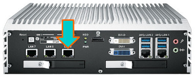
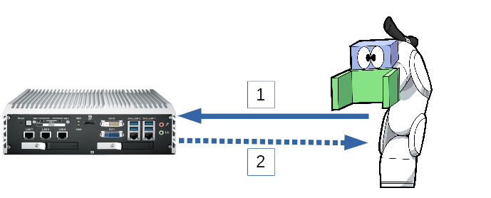

# ロボットと接続する

## 1.配線  
ロボットとVTコントローラをLANケーブルで接続します。

## 2.ロボットの接続設定  
ロボットのネットワーク設定を行います。各機種毎の設定方法は以下のようです。

* [FANUC](SetupFanuc.md)
* [Motoman](SetupMotoman.md)
* [Melfa](SetupMelfa.md)

## 3.通信手段について  

ロボットとVTコントローラの接続には２系統あります。ひとつはロボット側から撮像コマンドなどをVTコントローラへリクエストする①リクエストチャネル、もうひとつはVTコントローラがロボットから一定周期に、座標値などを受取る②ストリーミングチャネルです。  
リクエストチャネルはVTコントローラとの通信においては必須なのに対して、ストリーミングチャンネルはロボット側の機能に依存するため、あくまでオプションです。

### 3-①リクエストチャネル  
VTがサポートしている機能は下表のとおり。

|リクエスト略号|リクエスト名|説明|レスポンス|
|:---|:---|:---|:---|
|X0|リセット|保存領域の撮像データをクリアします|OK/NG|
|X1|キャプチャ|撮像を行いデータを保存領域に蓄えます|OK/NG|
|X2|ソルブ|撮像データを解析します|OK(Transform)/NG|
|X3|レシピ呼出|保存されているレシピを呼び出す|OK/NG|

これらのリクエストは各ロボットの**ロボット言語**から呼び出します。各ロボットでの呼び出し方を下表に示します。

|リクエスト略号|Motoman|Fanuc|Melfa|
|:---|:---|:---|:---|
|X0|CALL JOB:ROVI_RESET|ﾖﾋﾞﾀﾞｼ ROVI_RESET|Gosub *X0|
|X1|CALL JOB:ROVI_CAPTURE|ﾖﾋﾞﾀﾞｼ ROVI_CAPTURE|Gosub *X1|
|X2|CALL JOB:ROVI_SOLVE|ﾖﾋﾞﾀﾞｼ ROVI_SOLVE|Gosub *X2|
|X3|CALL JOB:ROVI_RECIPE|ﾖﾋﾞﾀﾞｼ ROVI_RECIPE|Gosub *X3|

詳しい使い方は、サンプルプログラムを参照ください。
