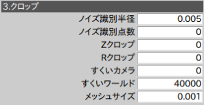
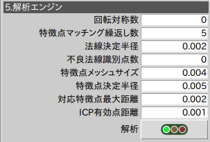

# 物体認識

## 特徴点マッチング
2D画像特徴点と同様、3D点群においても夫々の点の特徴量が定義されます。適切かつ高速に特徴量を算出するには、いくつかの調整が必要です。
### メッシュサイズの決定  
メッシュサイズは物体の空間サンプリングレートです。 

物体表面の凹凸に応じて、メッシュサイズを調整します。特徴点マッチングは時間のかかる処理のため、全ての細かい特徴をサンプリングするようなサンプリングは好ましくありません。物体を識別出来そうな箇所の凹凸に合わせることが重要です。
#### メッシュサイズの違い
<table>
<tr><td><td><td>
</table>
### 法線の決定  
法線決定半径は、その点周りの微小平面を定義するための点を点群全体から抽出するものです。スキャンされた3D点群には法線がありません。この部分点群にフィットさせた微小平面の法線として定義されます。

#### 法線決定半径の違い
<table>
<tr><td><td><td>
</table>
### 特徴点メッシュサイズ  

## ICPマッチング  

## 特徴点マッチング
