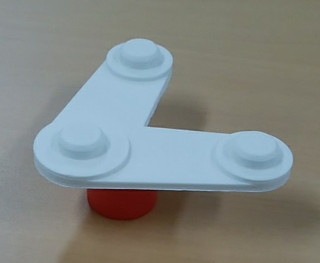

# **VT**ピッキングチャレンジ

## 1.ロボットプログラムのサンプルを取得する  
まずは**VT**のサンプルプログラムを取得します。これをベースにアレンジするのがおすすめです。
各機種毎のサンプルプログラムは以下からダウンロードできます。


* Not yet


* Not yet


* Not yet


## 2.ワークを準備する  
チャレンジするワークを準備します。ワークを嵩上げして設置すると、マスターデータを切り出し易いのでおすすめです。

