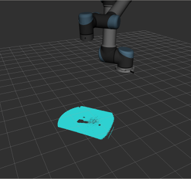
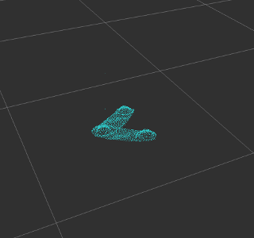

# マスター登録する  
まず最初に対象ワークのマスター3Dデータを採取します。マスター3Dデータは、再生時にワークを見つけるためのテンプレートとなるデータで、ソルバーは環境中からマスターと同じ形状の物体を探します。

## 1.プログラム  
サンプルプログラムの以下は、
- 撮影位置に移動
- 3Dデータの採取  
を行う部分です。

~~~
NOP
*RESET
CALL JOB:ROVI_RESET
GETS LI000 $RV
JUMP *STOP IF LI000<>0
*CAPTURE
MOVJ VJ=20.00  //撮影位置
TIMER T=0.500
CALL JOB:ROVI_CAPTURE
GETS LI000 $RV
JUMP *CAPTURE IF LI000<>0
~~~


## 2.撮影位置に移動  
ロボットをジョグ動作などで、撮影位置に移動します。撮影位置は教示点と異なっても構いません。

## 3.撮影する  
撮影はロボット言語の

~~~
ﾖﾋﾞﾀﾞｼ ROVI_CAPTURE
~~~


~~~
CALL JOB: ROVI_CAPTURE
~~~


~~~
Gosub *X1
~~~

呼出します。。サブルーチンはいくつかの基本命令で構成されているので、一連の命令を全て実行し、呼び出した次の行に戻ってくるまでステップ実行します。


また撮影は、設定パネルの【2.位相シフト調整/3Dスキャン】押下でも可能です。


撮影に成功すると、下図のようにワークの3Dデータが取り込まれます。

失敗した場合は、サンプルプログラムでは、再びサブルーチン呼出の前の行まで戻ります。

再撮影時は3Dデータをクリアしてください。クリアは設定パネルの【2.位相シフト調整/クリア】押下か、ロボット言語の以下のサブルーチンで行います。


~~~
ﾖﾋﾞﾀﾞｼ ROVI_RESET
~~~


~~~
CALL JOB: ROVI_RESET
~~~


Gosub *X0

撮影テクニックの詳細はAppendixの[撮影のポイント](HackCapture.md)を参考

## 4.加工する  
### ダウンサンプリング
撮影した3Dデータは、カメラの解像度でサンプリングされています。ワークの大きさによっては、このままでは解析に時間がかかります。このためダウンサンプリングにて点密度を一定化します。  
【3.クロップ/メッシュ】にて点の間隔を設定することで、ダウンサンプリング処理が行われます。
### クロップ  
撮影した3Dデータには、背景の台などワーク以外のものが含まれます。これらを削除(クロップ)したものをマスターデータとして登録します。背景を削除する最も簡単な方法は、点のすくいとり機能です。これは次のように使います。
1. ランチャーからセットアップを選び、設定パネルを表示する
2. 【3.クロップ/すくいワールド】にて取りたい点数を入力します
3. 鉛直上側から入力された点数分が表示されます
4. 背景がなくなるように点数を調整します

## 4.登録する  
設定パネルの
1. 【4.マスター管理/マスター登録】にて登録する
2. 【3.クロップ/すくいワールド】を元の値に戻す

