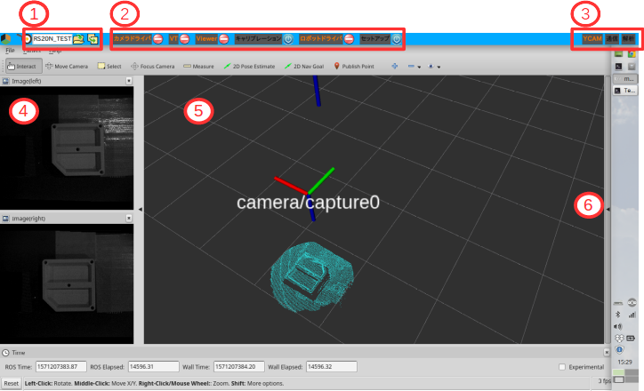
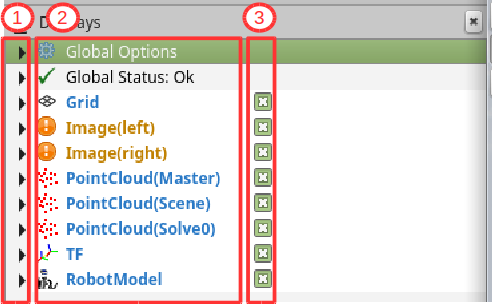
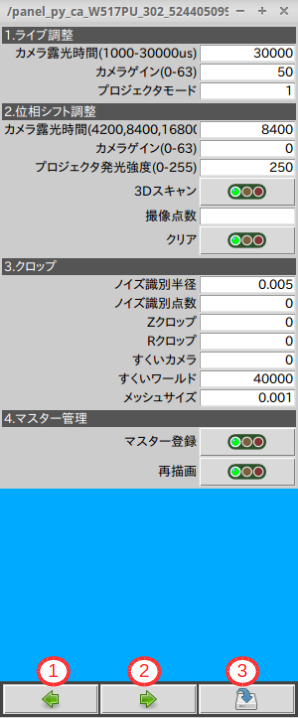
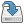

# VTの画面構成

## 1.各部の構成

VTを起動すると、以下の画面が表示されます。各部分は機能ごとのグループにて構成されていいます。グループ毎の機能を下表に一覧します。

|番号|項目グループ|説明|
|:---|:---|:---|
|①|レシピ|レシピ管理(呼出、作成)機能エリアです|
|②|ランチャー|プログラム管理(起動、終了)機能エリアです|
|③|インジケータ|システムの状態を表示するエリアです|
|④|カメラビュー|カメラ画像の表示エリアです(上＝左カメラ、下＝右カメラ)|
|⑤|3Dビュー|ロボットや採取した3D点群を表示するエリアです(Rvizビューワ)|
|⑥|表示項目タブ|表示項目の選択、設定を行うタブ(RvizのDisplayタブ)|

## 2.各グループの機能説明
### ①レシピ

|表示|項目名|説明|
|:---|:---|:---|
|RS20N_TEST|名称|現在選択されているレシピ名が表示されます|
||選択|レシピ一覧を表示し、レシピを選択します|
||名前を付けて保存|現在選択されているレシピを名前を変えて保存します|

### ②ランチャー

|表示|機能名|説明|
|:---|:---|:---|
||起動/停止ボタン|ボタン左に表示されているプログラムの起動/停止を行います|

|プログラム名|内容|
|:---|:---|
|<input value="VT" size="4" style="color:orange;background-color:black"></input>|マスター登録、認識など、VT機能を一括起動します|
|<input value="Viewer" size="6" style="color:orange;background-color:black"></input>|スクリーンの大半を占めるRvizを起動します|
|<input value="カメラドライバ(VGA)" size="15" style="color:orange;background-color:black"></input>|VGAモードのカメラドライバを起動します|
|<input value="ロボットドライバ" size="12" style="color:orange;background-color:black"></input>|産ロボとの接続に必須であるロボットドライバを起動します|
|<input value="セットアップ" size="8" style="color:orange;background-color:black"></input>|レシピの編集に必要な**設定パネル**を起動します。**設定パネル**の項目の詳細については後述します。|
|<input value="カメラドライバ(SXGA)" size="16" style="color:orange;background-color:black"></input>|SXGAモードのカメラドライバを起動します。VGAモードのカメラドライバが起動されている場合は、先にVGAのドライバーを停止してから、こちらを起動します。|
|<input value="キャリブレーション" size="13" style="color:orange;background-color:black"></input>|ロボットキャリブレーションに必要なプログラムを一括起動します。VTが既に起動されている場合は、先にVTを停止してから、こちらを起動します。|

### ③インジケータ  
インジケータはシステムの動作状態を示します。

|表示名|点灯状態|
|:---|:---|
|<input value="YCAM" size="5" style="color:orange;background-color:black"></input>|YCAMがレディ状態です。撮像が可能です。|
|<input value="通信" size="5" style="color:orange;background-color:black"></input>|ロボットとの通信中です。|
|<input value="解析" size="5" style="color:orange;background-color:black"></input>|解析処理中です。VTでは物体認識を行っている状態です。|

### ④カメラビュー  
カメラのストリーミング画像を表示します。

|表示位置|内容|
|:---|:---|
|上|**左**カメラストリーミング画像|
|下|**右**カメラストリーミング画像|

### ⑤3Dビュー  
Rvizの3Dビューワを表示しています。表示項目は *Display* 設定にて変えることができます。 *Display* 設定は⑥のタブを引き出すことで現れます。

### ⑥Display設定

Rvizの *Display* タブからは、表示項目の編集、追加などができます。詳細は[チートシート](CheetRviz.md)を参照ください。

|表示|機能|
|:---|:---|
|①|項目の詳細の開／閉|
|②|表示項目名|
|③|項目の表示／非表示選択|

## 3.設定パネル  
ランチャーから *セットアップ* を起動すると以下のようなパネルが表示されます。このパネルからは**レシピの編集**のための
- パラメータの入力
- トピック(内部変数)モニター
- コマンド(機能の発動)  
が出来ます。

### 設定パネルの操作

|表示|項目名|説明|
|:---|:---|:---|
||前ページ|パネルを前ページに切り替えます|
||次ページ|パネルを次ページに切り替えます|
||保存|現在表示されているパラメータを保存します|

### 便利な隠れ機能
- パラメータの入力カラム上で右クリックすると、元の値に戻すことができます(*保存* 後は戻りません)