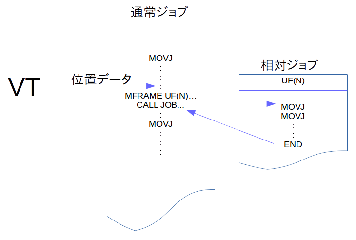

# Motomanシリーズ/セットアップ手順

## はじめに  
本文書は、VTを安川電機製Motomanシリーズで利用するときのセットアップ手順について説明するものです。  
Motomanシリースでは、ジョブ(プログラムの実行単位)には「標準ジョブ」と「**相対ジョブ**」があります。標準ジョブ部は、教示時と同じ動作軌跡を辿る通常のプログラムです。これに対して相対ジョブ部は任意のユーザ座標を基準とした動作軌跡を辿ります。  
VTをMotomanで使う時のプログラムは、下図のように「標準ジョブ」と「相対ジョブ」を組み合わせた構成となります。
標準ジョブ部は、VTが算出した座標データを相対ジョブのユーザ座標に設定します(MFRAME命令)。その後、相対ジョブをCALLすることで、相対ジョブは対称物に追従した動作軌跡で実行されるという、VTの動作を実現します。  
  

## 要件  
コントローラには以下のオプションが必要です。

1. TCP通信オプション
2. 相対ジョブオプション  
  相対ジョブの詳細については「相対ジョブ機能操作説明書」を参考のこと。

-----------------

## 手順

### 1. ファイルのダウンロード
[Motoman](https://github.com/YOODS/rovi_industrial/)から以下の必要なファイルをダウンロードします。

|ファイル名|分類|説明|
|:---|:---|:---|
|VT.out|MotoPlusアプリ|VTとの接続を行うタスク|
|ROVI_RESET.JBI|ジョブプログラム|X0ファンクションを呼び出すジョブ|
|ROVI_CAPTURE.JBI|ジョブプログラム|X1ファンクションを呼び出すジョブ|
|ROVI_SOLVE.JBI|ジョブプログラム|X2ファンクションを呼び出すジョブ|
|ROVI_RECIPE.JBI|ジョブプログラム|X3ファンクションを呼び出すジョブ|
|メイン.JBI|ジョブプログラム|VTのサンプルジョブ。ピッキングチャレンジはこのプログラムを用います|
|ピック.JBI|ジョブプログラム|VTのピッキング経路のみのジョブ|

以上のファイルは、ロボットコントローラに読み込ませるため、USBメモリーにコピーします。

### 2. MotoPlusアプリのインストール  
1. TBに作成したUSBメモリーを差し込みます
2. ロボットコントローラをメンテナンスモードで起動します
3. MotoPulsアプリを選びます
4. ロード？を選びます
5. VT.outを選びます
6. 通常モードで再起動します

### 3. IPアドレス設定  
IPアドレスはIデータメモリーの以下領域に割り当てられています。TBのデータメニューを選び入力します。

|アドレス|説明|デフォルト(VTコントローラ初期値)|
|:---|:---|:---|
|I080|アドレス上位8ビット|192|
|I081|アドレス中位8ビット|168|
|I082|アドレス中位8ビット|221|
|I083|アドレス下位8ビット|10|

### 4. ジョブの読み込み
1. USBメモリーが差し込まれた状態で、TBのファイルメニューを選びます。
2. 
