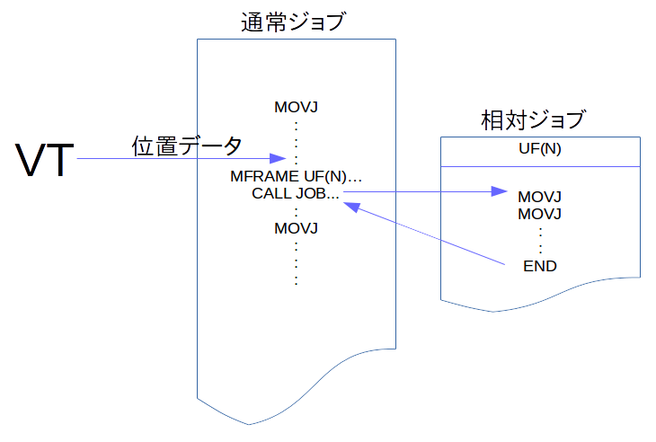

# 教示する

1. ワークはマスター登録した位置から動かないよう注意ください。
2. ワークが動いてしまった場合は[再教示](ReTeaching.md)の手順を辿ってください。

## 1.VT教示する点  

VTはワークの位置・姿勢変化に追従して教示点を移動します。移動する教示点はすべてではなく、ピッキングであれば「アプローチ」「グラスプ(把持)」「ピックアップ」の最低３点がこれに該当します。  

## 2.プログラムの構造  
VT教示の対象点をプレイバックする前には
- 新たな座標系への切替え
が必須です。


このためVTのプログラムは以下のような構造になります。
~~~
<新たな座標系に切替え>
<移動 アプローチ点>
<移動 グラスプ点>
<移動 ピックアップ点>
<元の座標系に戻す>
~~~



Motomanシリースでは、新たな座標系での再生は**相対ジョブ**でしか出来ません。従って下図のように「標準ジョブ」と「相対ジョブ」を組み合わせた構成となります。
標準ジョブ部は、VTが算出した座標データを相対ジョブのユーザ座標に設定します(MFRAME命令)。その後、相対ジョブをCALLすることで、相対ジョブ内の教示点は対象物に追従した動作軌跡で再生されます。  
  
### 2-1. VT変換部サンプルプログラム(標準ジョブ)
~~~
*SOLVE
CALL JOB:ROVI_SOLVE (90)  //解析結果をP090へ
GETS LI000 $RV
JUMP *SOLVE IF LI000<>0
*VTMOV
MFRAME UF#(1) P090 BF  //P090をUF1に設定
CALL JOB:<相対ジョブ>
MOVJ VJ=20.00
MOVL V=4.0  //プレース
CALL JOB:HAND3_OFF
END
~~~
### 2-2. ピッキング動作サンプルプログラム(相対ジョブ)
~~~
NOP
MOVJ VJ=20.00
MOVJ VJ=20.00
MOVJ VJ=1.00  //GLASP
CALL JOB:HAND3_ON
TIMER T=1.000
MOVJ VJ=5.00
MOVJ VJ=20.00
END
~~~


## 3.教示  
以下を確認して、通常の教示を行います。
1. マスター登録した座標系と同じ座標系(通常はベース０)が選択されている
2. マスター登録した位置から、ワークが動いていない
